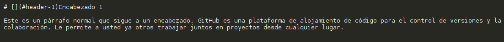
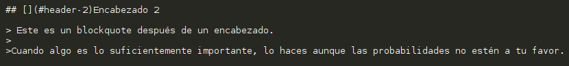
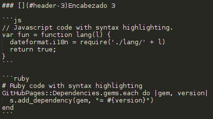
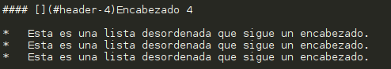
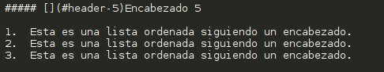
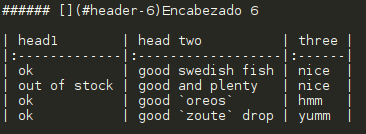
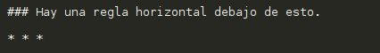
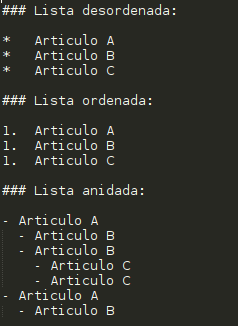
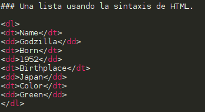

TIPOS DE TEXTOS

Text can be **bold**, _italic_, or ~~strikethrough~~.

[Sobre mi](another-page).


# [](#header-1)Encabezado 1

Este es un párrafo normal que sigue a un encabezado. GitHub es una plataforma de alojamiento de código para el control de versiones y la colaboración. Le permite a usted ya otros trabajar juntos en proyectos desde cualquier lugar.




## [](#header-2)Encabezado 2

> Este es un blockquote después de un encabezado.
>
>Cuando algo es lo suficientemente importante, lo haces aunque las probabilidades no estén a tu favor.




### [](#header-3)Encabezado 3

```js
// Javascript code with syntax highlighting.
var fun = function lang(l) {
  dateformat.i18n = require('./lang/' + l)
  return true;
}
```

```ruby
# Ruby code with syntax highlighting
GitHubPages::Dependencies.gems.each do |gem, version|
  s.add_dependency(gem, "= #{version}")
end
```



#### [](#header-4)Encabezado 4

*   Esta es una lista desordenada que sigue un encabezado.
*   Esta es una lista desordenada que sigue un encabezado.
*   Esta es una lista desordenada que sigue un encabezado.




##### [](#header-5)Encabezado 5

1.  Esta es una lista ordenada siguiendo un encabezado.
2.  Esta es una lista ordenada siguiendo un encabezado.
3.  Esta es una lista ordenada siguiendo un encabezado.




###### [](#header-6)Encabezado 6

| head1        | head two          | three |
|:-------------|:------------------|:------|
| ok           | good swedish fish | nice  |
| out of stock | good and plenty   | nice  |
| ok           | good `oreos`      | hmm   |
| ok           | good `zoute` drop | yumm  |




### Hay una regla horizontal debajo de esto.

* * *




### Lista desordenada:

*   Articulo A
*   Articulo B
*   Articulo C

### Lista ordenada:

1.  Articulo A
1.  Articulo B
1.  Articulo C

### Lista anidada:

- Articulo A
  - Articulo B
  - Articulo B
    - Articulo C
    - Articulo C
- Articulo A
  - Articulo B




### Una lista usando la sintaxis de HTML.

<dl>
<dt>Name</dt>
<dd>Godzilla</dd>
<dt>Born</dt>
<dd>1952</dd>
<dt>Birthplace</dt>
<dd>Japan</dd>
<dt>Color</dt>
<dd>Green</dd>
</dl>



